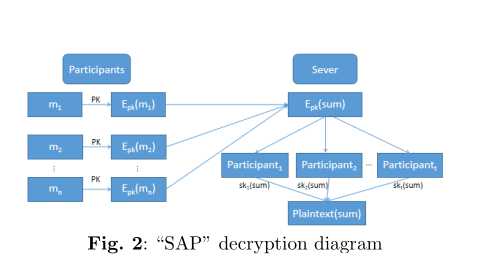

---

# Distributed Paillier Cryptosystem

This document outlines the implementation of a distributed Paillier cryptosystem designed for secure data aggregation while preserving privacy. 

## Overview

The distributed Paillier cryptosystem provides a method for secure aggregation by utilizing a threshold mechanism to distribute partial private keys among participants. This cryptosystem ensures data privacy and allows for efficient computations through its additive homomorphic properties.

## Advantages

1. **Threshold Mechanism**: The private key is decomposed into partial keys distributed to participants. A sufficient number of these partial keys are required to decrypt ciphertext and retrieve plaintext information.
  
2. **Additive Homomorphism**: Operations on plaintext can be achieved through multiplication operations on ciphertext, maintaining data privacy during aggregation.

## Components

The distributed Paillier cryptosystem can be divided into four main components:

### 1. Key Generation

- **Parameters**:
  - Let \( \Theta \) be the security parameter.
  - Let \( p \) and \( q \) be large primes.
  - Compute \( N = pq \) and \( \lambda = \text{lcm}(p-1, q-1) \).
  
- **Keys**:
  - Public Key: \( pk = N \)
  - Private Key: \( sk = \lambda \)

### 2. Private Key Splitting

- Choose \( \delta \) such that:
  - \( \delta \equiv 0 \mod \lambda \)
  - \( \delta \equiv 1 \mod N \)

- Define the polynomial:
  \[
  q(x) = \delta + \sum_{i=1}^{k-1} a_i x
  \]
  where \( a_1, \ldots, a_{k-1} \) are \( k-1 \) random numbers selected from \( \mathbb{Z}_{\lambda N}^2 \). 

- Each party holds different non-zero elements \( \alpha_1, \ldots, \alpha_n \in \mathbb{Z}_{\lambda N}^2 \) and receives a portion of the private key \( sk = q(\alpha_i) \).

### 3. Encryption Algorithm

- For a given plaintext \( m \), choose a random number \( r \in \mathbb{Z}_N \).
  
- The ciphertext \( c \) is generated as:
  \[
  c = [m] = g^m \cdot r^N \mod N^2 = (1 + mN) \cdot r^N \mod N^2
  \]

### 4. Decryption Algorithm

- Partial decryption of ciphertext \( c \) is performed using the partial private keys held by the participants.

- For convenience, denote the partial decryption results as \( CT(i) \). Using the Chinese Remainder Theorem, we compute:
  \[
  \delta = \lambda \cdot (\lambda^{-1} \mod N^2) \mod \lambda N^2
  \]
  
- The partial decryption result is given by:
  \[
  CT(i) = [m]^{q(\alpha_i)} \mod N^2
  \]

- Each user holding part of the private key partially decrypts the ciphertext, obtains their partial decryption result, and sends it to the cloud server.

## Conclusion

The distributed Paillier cryptosystem offers a robust solution for secure aggregation of data while maintaining the privacy of individual contributions. By leveraging homomorphic properties and distributed key management, this approach enables efficient computation without compromising sensitive information.

---
